# Developer Log

Random assorted notes from trying to analyze data from DJing.

## VirtualDJ data discovery

I played around a lot in trying to understand what sort of data we can get from
VirtualDJ, see [VirtualDJ notes](./VirtualDJ%20notes.md).

**TL;DR**

- The `database.xml` has representations of all songs and song metadata.
- This metadata requires a fair amount of cleaning and data transform to be useful.
- This can be combined with data from playlists (etc.) to do interesting things.

## Mixcloud data discovery

By poking around in the network tools while looking at Mixcloud, I was able to find some
ways to extract data that is otherwise not easily queryable from the documented APIs. See
[Mixcloud notes](./Mixcloud%20notes.md).

**TL;DR**

- Mixcloud stores pretty much everything in a Graph database.
- This is hard to query without an understanding of that data shape, but we can use /
lightly modify existing queries to get data we want.
- This includes stuff like set metadata, engagement statistics, and links.

## Create energy graph from sets

The first big project I want to do is create graphs showing the energy curves of sets
I've recorded.

Initially, my thought was to:

1. Read the cue points from recorded set files (since VDJ adds
these automatically while recording).
2. Look up the songs by title (with possible mapping for places where these don't match).
3. Pull the energy from the song metadata (encoded as "Rating") for my system.

But then I realized that I *also* have matching playlists for each set I record. It would
be easier to just point my scripts to those playlists, which makes the job of matching
the song order just a little bit easier. The new idea:

1. Point to a playlist, get the songs / order from playlist.
2. Look up songs by path (these should be an exact match and less prone to ambiguity).
3. Pull energy from song metadata in the database.
4. Profit!

A playlist has this schema:

```m3u
#EXTVDJ:<filesize>{bytes}</filesize><artist>{string}</artist><title>{title}</title><remix>{remix}</remix><songlength>{seconds}</songlength>
{filepath}
```

First, we gotta get our `database.xml` into a better form, using `scripts/convert.py` to convert the `database.xml` to `database.json`.

Next, I created a `playlists.py` to go to a specific playlist and get song metadata.

This finds the playlist `.m3u` file and reads out the filepaths there for each song.

Then it has to look up these songs from the database. Since the database is just a list
of songs, it has to manually iterate through them to find a matching entry... so this is
slower, but it works.

Once it finds a matching song, we have all the song metadata. Iterating over this list we
can query each song for its Rating (encoded as the `@Stars` attribute) and then use
`matplotlib` to graph the result.

**An early example**:

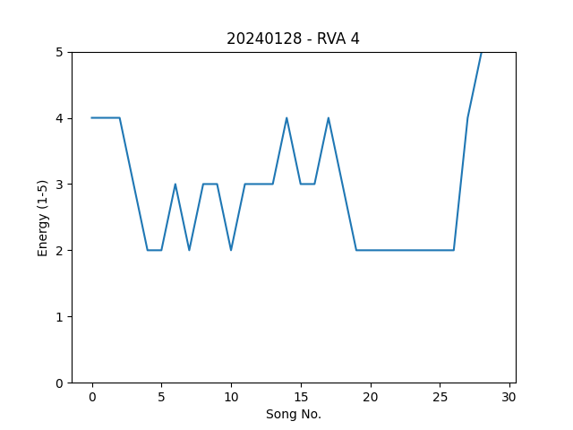

### Graph & Script Improvements

Next I played with some improvements both to the script and the graphs:

- Take set name from command line arguments.
- Added search, will search several locations (including direct path, and "Past Sets")
  for provided playlist.
- Added color-coded bars for prettier graphs.

At the end of all of this, I have a script that looks like this:

```sh
python scripts/playlists.py <name-or-path-to-playlist>
```

And produces graphs like this:

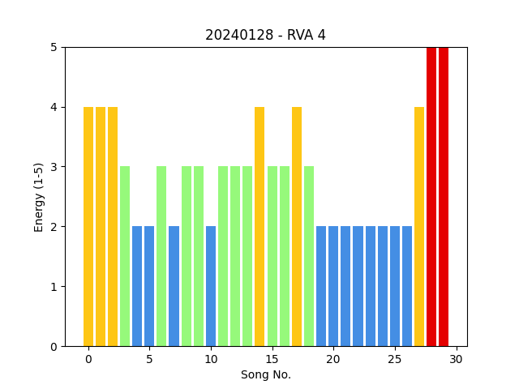

### Multi Graph

Next up I wanted the ability to show multiple sets at the same time. I refactored the
script to take multiple input arguments and convert into subplots in the graph.

This required a few tweaks to the initial graphing function, but now works for both
individual and multiple inputs.

```sh
python scripts/playlists.py "playlist 1" "playlist 2" "playlist 3" "playlist 4"
```

Creates an example like this one, where I graphed all 4 sets from  Richmond:

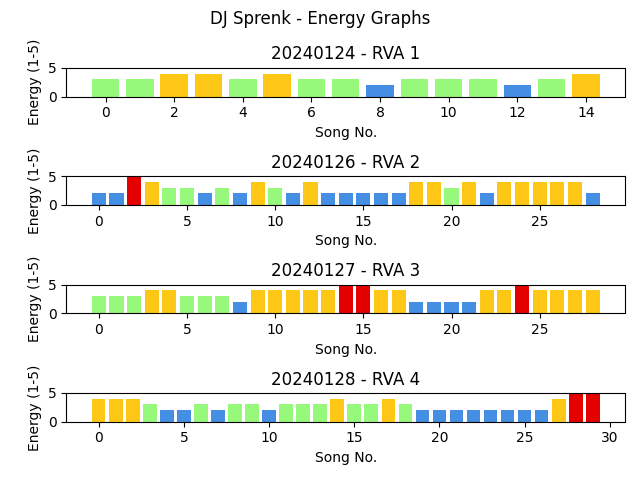

### Song align

Next, I wanted a way to show sets aligned to each other (by song). Another quick tweak
(as simple as setting x-axis based on the max set length) and we have the following,
togglable with the `--align` flag (which pointed out a bug I had to fix with how I was)
getting flags from my command line.

```sh
python scripts/playlists.py --align "playlist 1" "playlist 2" "playlist 3" "playlist 4"
```

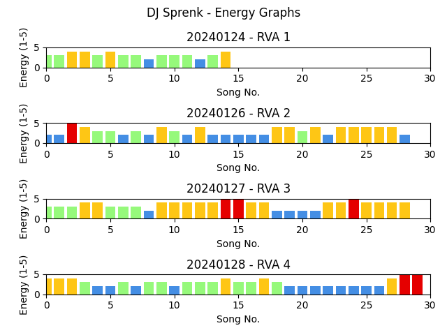

### Read playlists from file

A quality of life improvement I added was the ability to read playlists from a file.

This was to keep me from typing in lots of text when I could, instead, get this to a file.

I did this by first getting a list of playlists from a folder:

```sh
cd {playlist folder}
ls > playlists.txt
```

Then with some light regex, I was able to convert this to an array to make it even easier
to load into Python with `json.loads(playlist path)`.

So now I can run:

```sh
python scripts/playlists.py --file {playlists.json file path}
```

And run the script for many playlists.

This, however, has surfaced some pain points:

1. This is SLOW, since it has to do a song lookup for each song in each set. e.g. running
  this for all 48 playlists from 2023, this took 3 minutes. That's only a few seconds per
  set, but still...

2. For a long list of sets, the visuals are useless, they scale to fit in a single
  window (below)

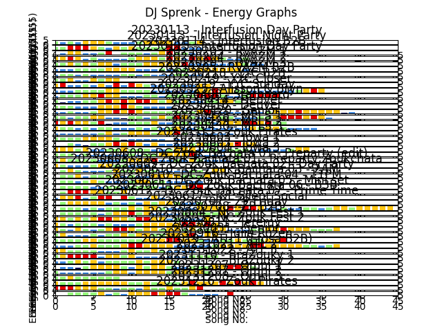

But this gives me new ideas for improvements:

1. Thinking a speed enhancement might be to add a better song lookup instead (or in
  addition to) a playlist lookup.

2. There isn't a way in Matplotlib to fix this, but this was never the end-game.
  Thinking of moving to web-based visualization / discovery. The other option is looking
  into PyQt programming which seems... hard.

Yay, new ideas!

### Web-based graphing

I want to (eventually) move this into a web-based visualization. This makes it more
easily sharable on the web and gets us lots of cool visualization / scaling tools like
D3 and reactive web development.

Using [this example](https://d3-graph-gallery.com/graph/barplot_basic.html), only lightly edited, I was able to get a version graphing from the exact same output data (`song-list.json`) produced by my other scripts.

2 Tricks I had to figure out:

1. CORS, how I loathe thee. Remembering that it is difficult to load local files for
  early JS development, I had to copy-paste song data in to a file, set it to a variable,
  and inject our data that way. Eventually, I'll likely move to putting that data either
  in the cloud or making a lightweight server to host those to the frontend.

2. D3 needs some form of unique index for each item. Our items were ordered but otherwise
  not guaranteed to be unique. I added a pre-processing step to add an index to each
  entry to keep them unique and ordered.

So by adding a file called `song-data.js` in `static`, and copy pasting the output from a `song-list.json` file, setting it to a variable referenced in our `graph.js` file..

```js
song_data = [ { <song data> }, { <song data> }...]
```

... we can get a super simple implementation in D3!

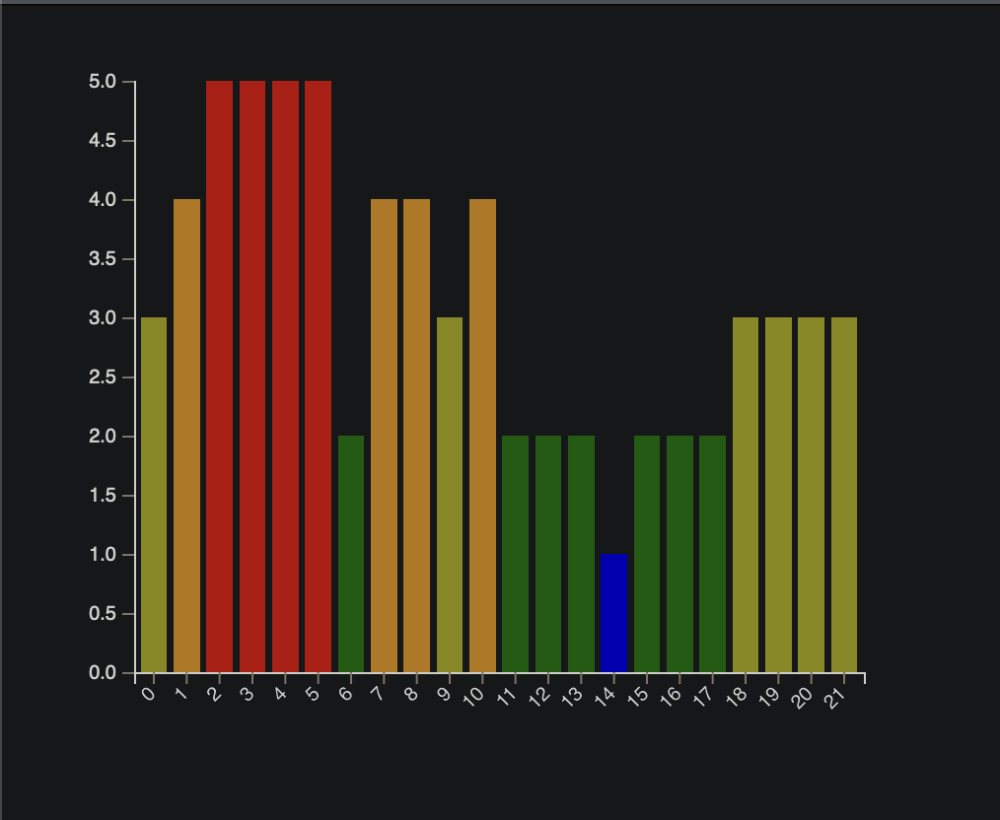

Next up I want to work on scaling and adding sub-plots as well as actually fetching the data (likely from a Flask backend?) to avoid hard-coding the source data.

### Using Plotly?

Chatting with my dad (also a software engineer and data nerd), he suggested looking at [Plotly](https://plotly.com/python/getting-started/) which has the ability to write graphs using a Python API and then export to HTML. Seems really cool!

[I played with this a bit](../scripts/plotly-test.py) and found it was pretty easy to make really basic graphs but it made a lot of annoying assumptions about desired behavior which I had trouble figuring out how to override. One example was assuming I wanted to group bars by color, which *did* let me color the bars, but failed to preserve order:

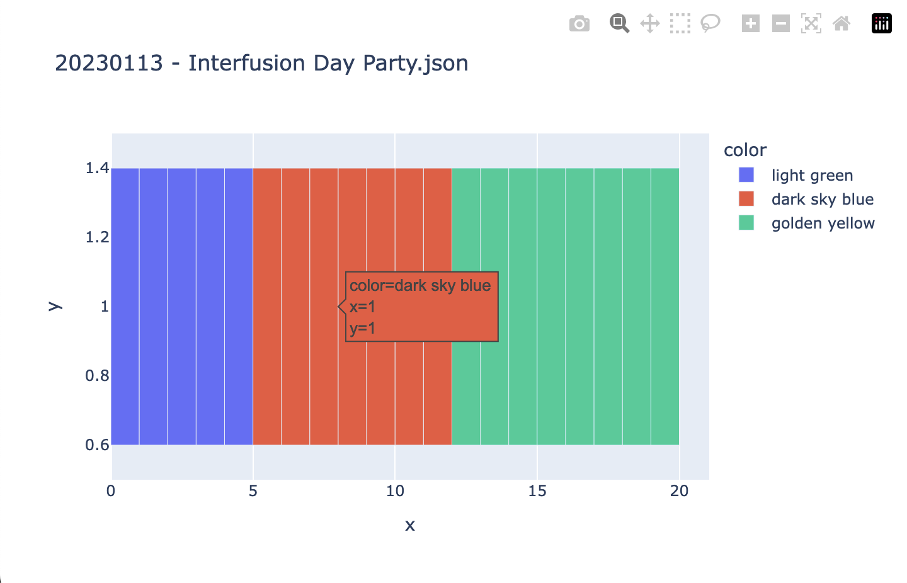

### Using Pandas

This did lead me to investigate using Pandas to ingest data (as it unlocked some cool, more advanced behaviors). It was powerful enough, I will probably [keep some of the data joining / ingest behavior going forward](../scripts/pandas-ingest.py), but I did end up abandoning Plotly.

### Return to D3

So, finally, I return to D3. I started trying to tweak some of the graph examples to look more like the horizontal timeline I desired:

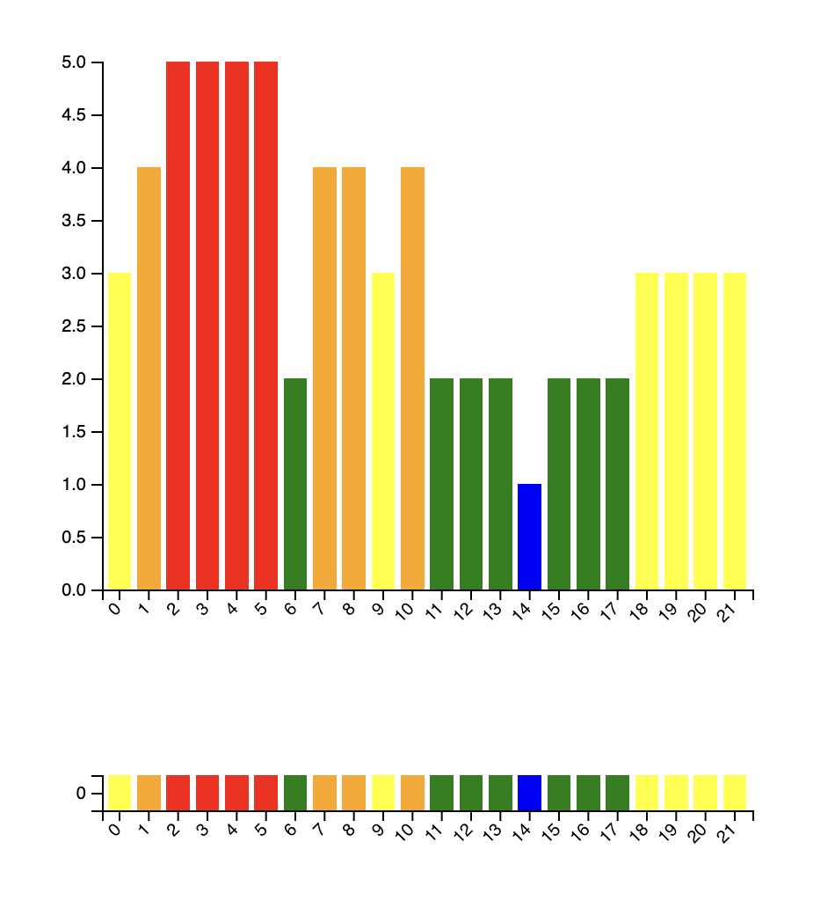

This got me closer, but I ended up abandoning D3's built in Graphing capabilities (again for the base assumptions built in that I didn't need) when I found I was able to build a timeline manually using colored rectangles to represent the songs.

Here is an early example:


### Multiple Charts

Next I had to do a bunch of refactors to split out behaviors into more discrete components.
This included splitting playlist data gathering and graphing, keeping around my tests
using Matplotlib and Plotly just for posterity.

This was largely inspired by moving to a different laptop, having to re-test earlier
scripts and by the fact that the VDJ playlist format changed recently.

New workflow looks like this:

1. `python scripts/convert.py` - creates JSON database
2. `ls vdj-database/MyLists/Past Events.subfolders > data/processed-files/sets-list.json` - lists out
  the playlists in the location I want to work with.
3. Convert that list to a JSON array using some regex.
4. `python scripts/playlists.py --file data/processed-files/sets-list.json` - reads that list and
  collects song metadata for the songs in each playlist.
4. `python scripts/pandas_ingest.py` - formats the song data using Pandas for easier
  unpacking. Outputs to `song-data.json`.
5. Copy that file into `static/`, imported into `index.html` for use in `graph.js`

This semi-convoluted workflow DOES result in a page full of graphs!

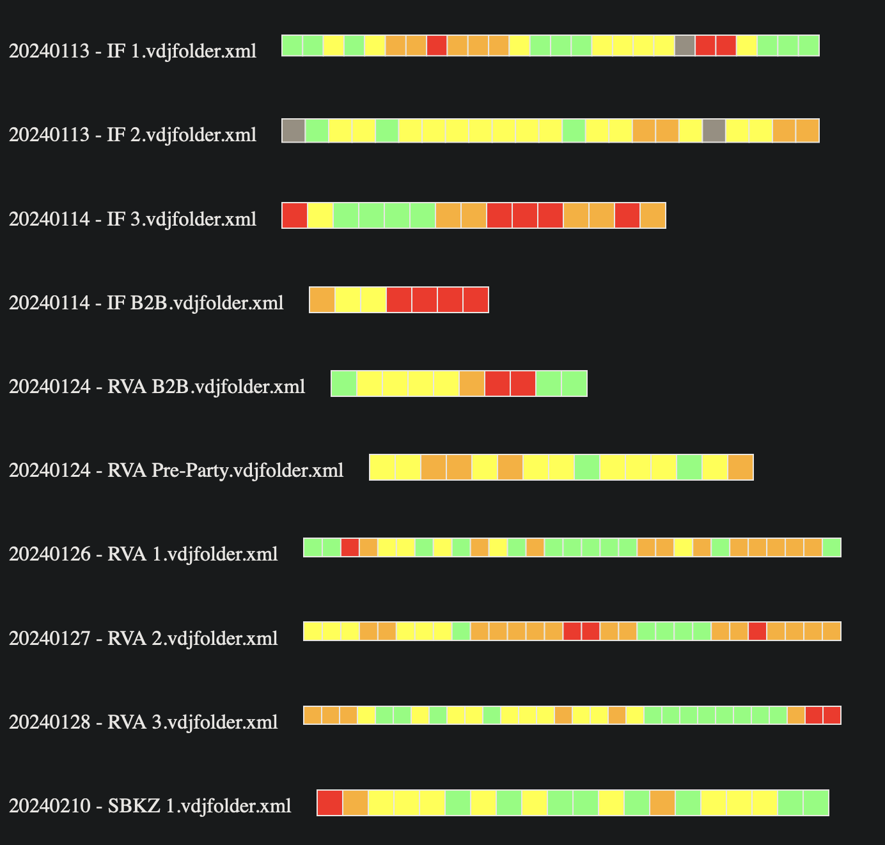

### Page layout with Flexbox & CSS Grid

After some consideration, I decided it was probably better to just switch over to divs
for displaying songs instead of drawing an SVG. This gets us better display wrap
behavior with HTML page layout / styling options.

This also allowed me to move most of the styling from D3 into a standalone stylesheet.

To get everything to display correctly, I decided to use flexbox for dynamically resizing
sets to the container when there are too many songs.

I ended up coupling this with CSS grid to get a nice layout on the overall page, still
relying on flexbox for the actual timelines.

Result now:

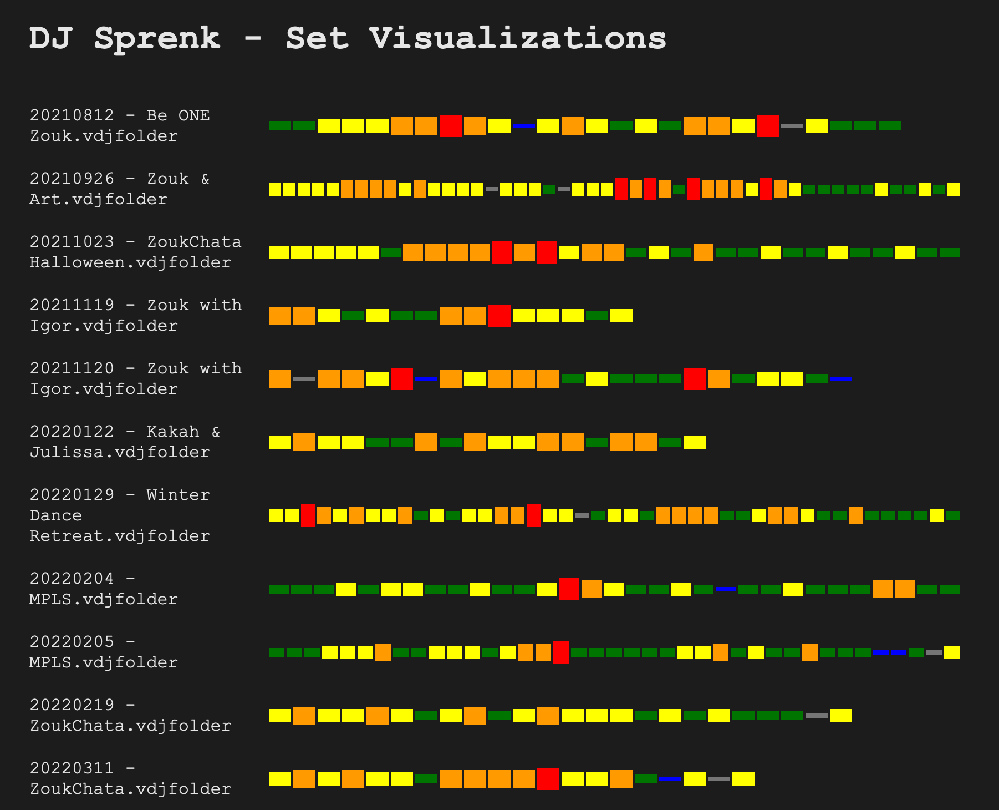

### Linking Mixcloud Data

The graphs above are a really good start, but I would like several improvements:

1. Human-readable titles instead of folder paths.
2. Links to Mixcloud.
3. Album art?

These would be trivial (if extremely time consuming) to manually link. First I started
extending `sets-data.json` to look like below:

```json
[
  {
    "playlist": "20240211 - SBKZ 4.vdjfolder",
    "name": "Crystalize | NY SBKZ Congress (Sunday Night)",
    "url": "https://www.mixcloud.com/djsprenk/20240211-ny-sbkz-4/",
    "img": "url"
  }...
]
```

However! I like automating things. Instead, going back to the Mixcloud API, I decided
it would be good to poll those APIs for the relevant data and then join it to my
existing data.

Playing with this endpoint, testing different limits, I can get 100 sets at a time.

```
https://api.mixcloud.com/{username}/cloudcasts/?limit=200&metadata=1
```

Returning this format:

```json
{
    "data": [
        {
            "key": "/{user}/{slug}/",
            "url": "https://www.mixcloud.com/{user}/{slug}",
            "name": "{name}",
            "tags": [ ... ],
            ...
            "pictures": {
                "{size}": "https://thumbnailer.mixcloud.com/unsafe/{w}x{h}/extaudio/{guid}",
                ...
            },
            "slug": "{slug}",
            ...
            "audio_length": {seconds},
        },
```

This did require a manual mapping of playlist path to Mixcloud slug.

Here I modified `sets-data.json` to now have both a playlist and a slug:

```json
[
    {
        "playlist": "{playlist}.vdjfolder",
        "slug": "{slug}"
    }
]
```

With that, I could update `pandas_ingest.py` to link Mixcloud title, URL, and thumbnail URL to the output `song-data.js`.

By tapping into this linked data, I could now mirror titles / URLS to the entries in my
graphs.

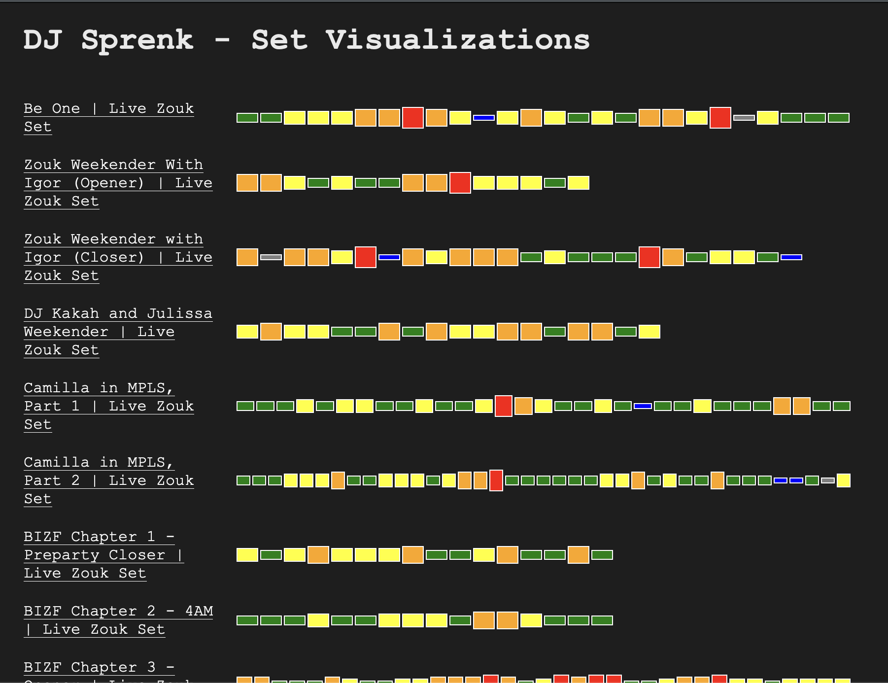

Expanding this with just a lil bit of styling, we can add thumbnails:

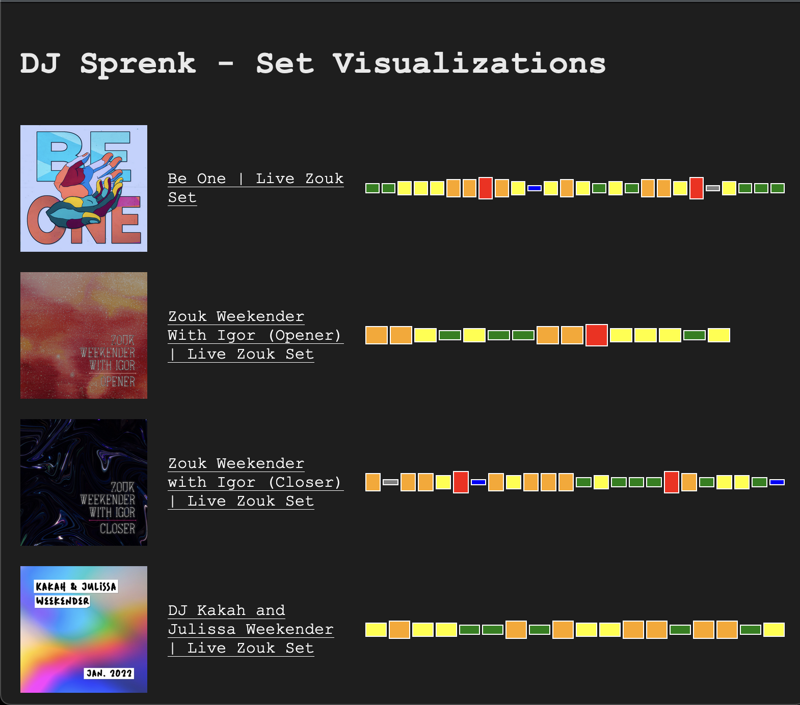

And with just a few more tweaks, added a mobile responsive view:

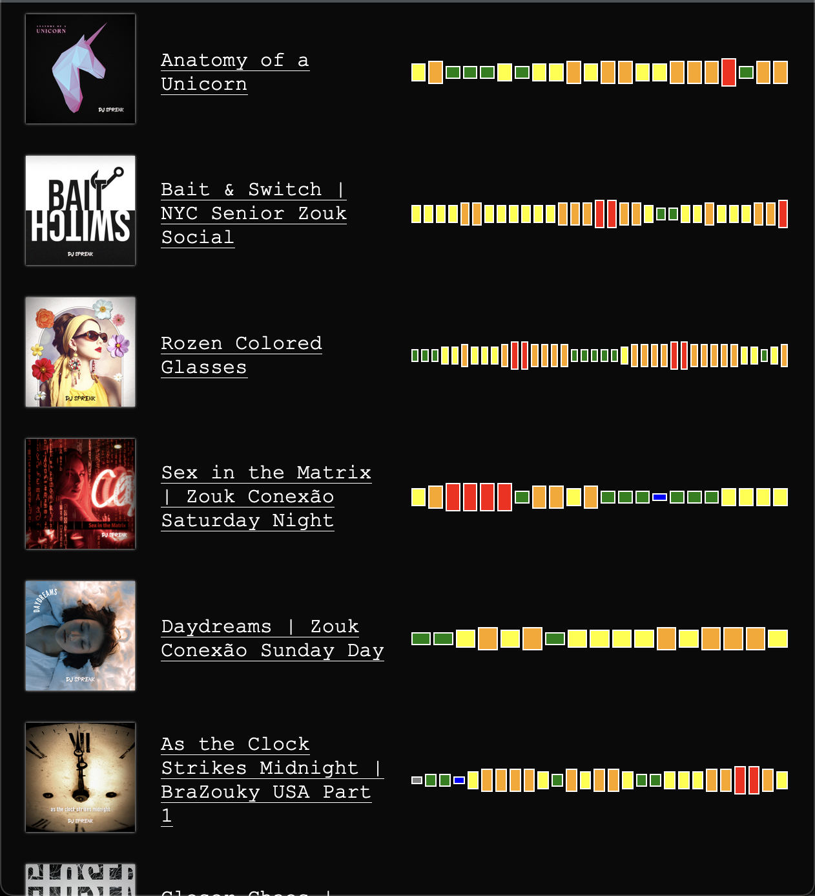

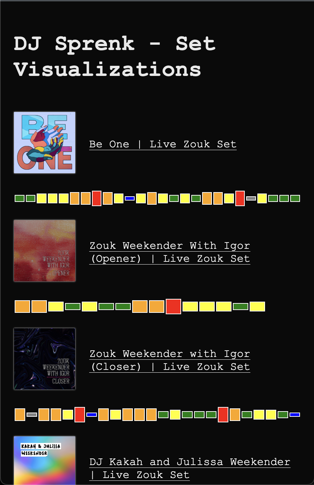

### Linking Recording Data

The next piece of data I'd like to link is BPM.

This is (most) canonically stored as metadata in VDJ associated with the recorded mixes.

To access this, I need to link the recordings which does require another mapping.

I added a `recording` field to my `song-mapper.json` as a first step:

```json
    {
        "playlist": "<playlist-path>",
        "slug": "<mixcloud-slug>",
        "recording": "<recording-path>",
        "type": "<produced-set | live-set>"
    },
```

Next I created a `recordings.py` script which acts very similarly to looking up song data
for playlists, except it looks for a single recorded file and gets the metadata
associated with it.

VDJ usually generates this metadata but I started (sometime in 2022) to manually add my
own BPM grids and cues. This means I should be able to rely on that data and just extract
all the POIs (which include BPM markers) from that data.

The easiest first step was to calculate min/max BPM (which also helps point out
recordings where I haven't updated the BPM, since the VDJ defaults are outside the range
we use for Zouk.)

This leaves me with my sets entries looking like this (with some additional styling
tweaks lumped in):

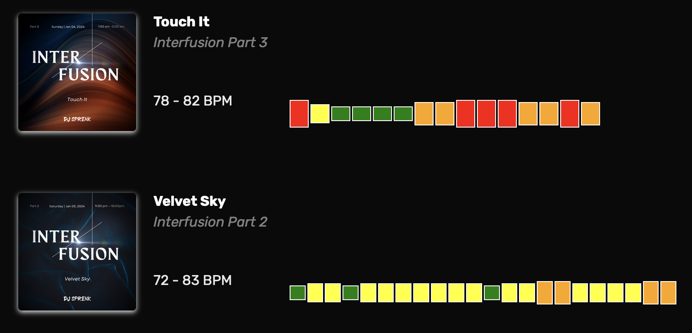

### Running BPM data

Next I want to add running BPM data. That is, I want to be able to see how BPM moves
throughout the course of a mix.

On its own, this isn't too bad. For all of the sets I record I make it a point to fix the
beatgrid and add cues for all the songs.

A trick will be figuring out how to tie this with the energy of the songs because it may
be hard to canonically map song position to song metadata.

But we can deal with that later.

The initial quest is just to chart the BPM of a set which came with a bunch of pitfalls.

First, VDJ just randomly leaves out some BPM data, it will have a timestamp but no value.

Here I thought it might just be the first beatgrid entry, so I came up with this lil
snippet to fill in that data:

```python
    # Often there's not a value for the first beatgrid marker.
    # Fill that with the first available BPM value
    first_valid_bpm = beatgrid['bpm'].dropna().iloc[0]
    beatgrid['bpm'].fillna(set_bpm, inplace=True)
```

But it looks like, on further inspection, it just leaves these out when the value is
equal to the set computed BPM (`Scan.@Bpm`). So I updated it to:

```python
     # BPM is left blank if it is the same as set BPM
    # Fill this in with set BPM (stored confusingly as seconds per beat)
    # i.e. VDJ BPM of 0.857143 correlates to 70 BPM
    set_bpm = (60 / recording_data_frame["Scan.@Bpm"].astype(float)[0]).round()
    beatgrid['bpm'].fillna(set_bpm, inplace=True)
```

Next it was important to learn to sort these values. This is done easily enough by using
this snippet.

```python
    pois["@Pos"] = pois["@Pos"].astype(float)
    pois = pois.sort_values(by="@Pos")
```

The first line is important or these timestamps (e.g. "123.456") get treated as strings
and get ordered incorrectly.

Another challenge is that Cue POIs (as differentiated from beatgrid POIs) don't have BPMs
associated with them. To fix that, I found a way to fill in missing values first by
backfilling then by forward filling missing values:

```python
    pois["@Bpm"] = pois["@Bpm"].fillna(method="bfill")
    pois["@Bpm"] = pois["@Bpm"].fillna(method="ffill")
```

Technically, a lot of this is out of discovery order. I found a lot of issues by getting
weird graphs and having to figure out why they were breaking.

But, at the end of the day, it was relatively trivial to graph, with a few caveats:

1. Had to play with X/Y scales to make it easier to scale data to a fixed box.
2. Learned that SVG graphs from top right to bottom left, had to flip order in the scale.
3. Manually added extra points to the data set to close the path in a nice way.

At the end of that, I end up with a simple graph that looks like this:

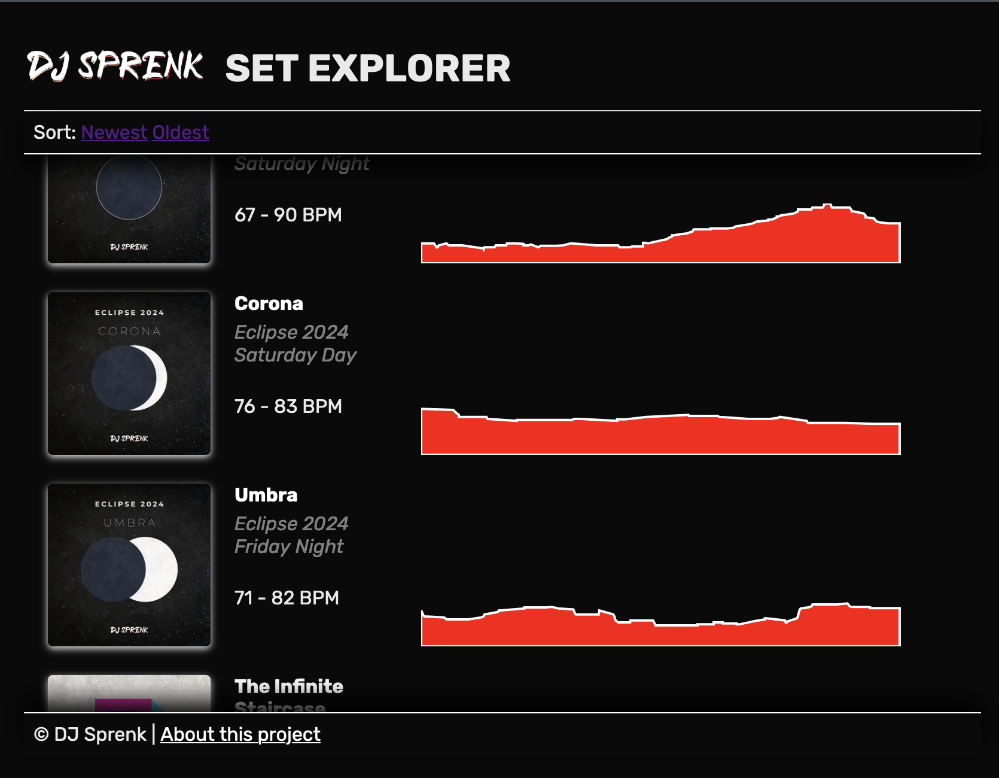

Next up, figure out how to color this correctly to match energy.

### BPM, time, and energy joins

I don't really have a good way to map song position to song data. This is because, while
POI timing (cues & BPMs) are easily read from the recording metadata, those cues for song
locations are just strings. This is differentiated from playlists which have direct
references to songs and their metadata.

I *could* try to match songs based on either CUE sheet or cue position on the recorded 
track by some sort of text match, but there are often typos / incongruities which make it
hard to canonically map.

Instead, the best approach I could think of is simple but makes a lot of assumptions.

Basically, for each cue point referring to a song in the recording, I make the assumption
that the playlist is exactly matched and ordered with the recording cues.

Thus, when I iterate through cues in the recording, I can look up the similar index from
the playlist and do a mapping of energy to the position / BPM of the cue in the
recording.

To aid with data cleanup, I added some warning logs that note when there is a length 
mismatch between these two but gracefully continues (cutting off at the end of the 
shorter of the two lists).

This pointed out about 2 dozen playlists where this is an issue. Not terrible, but not
great. Places I see issues in particular:

1. Places I accidentally left out cues / songs from playlist.
2. Sets with extra placehoder tracks (e.g. breaks) which I mostly took out in the
  original graphing steps.
3. Sets with live remixes (2 playlist entries, 1 cue point).

Still, all told, I ended up with a workable set of graphs as below:

(Note that I've left the old playlist graphs nearby for sanity checking.)

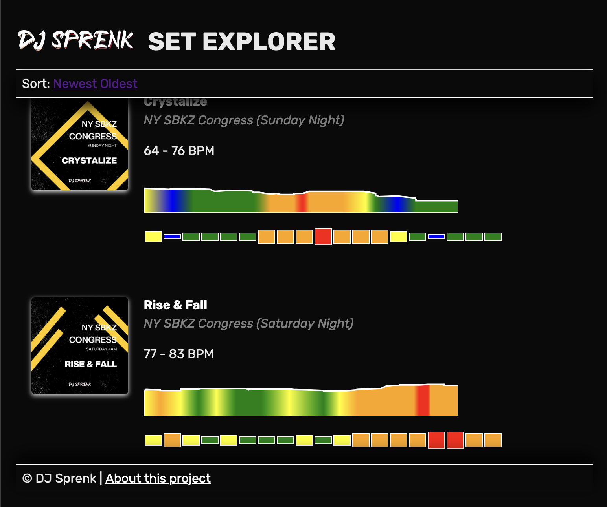

Eventually, I would love to fix this data and investigate better click / hover behavior.
It would be very cool to get these charts back to the point where you can hover and get song meta.

### Selectable graph types

An easier temp option is to just split out graph displays: Allow selecting of either
graph type. I did this with query params as I did with sort. To make the code less
cluttered, I also split out the graphs into separate JS files. Results below:

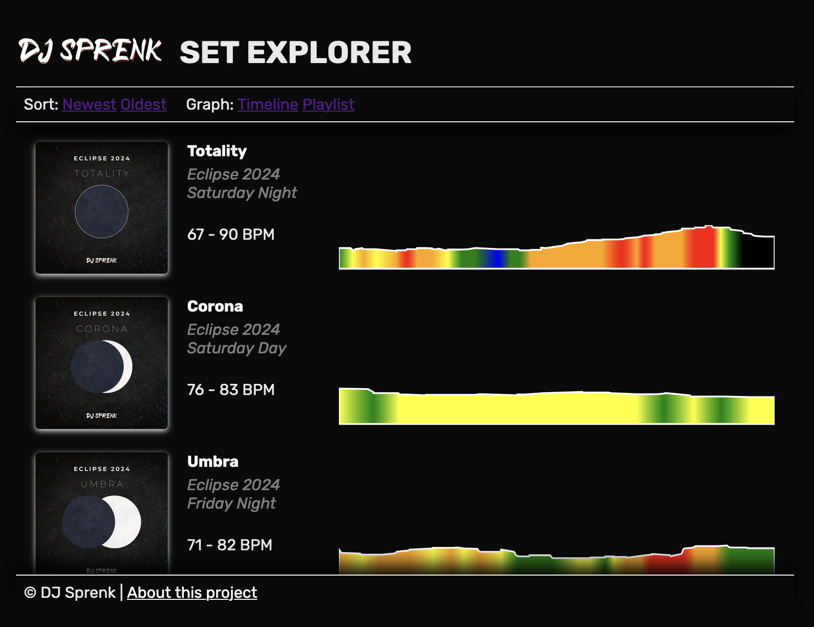

I further tweaked from the image above to turn the link-based controls to JS-based
controls to allow setting / resetting of multiple query params.

## Layout Tweaks

After all this, I tweaked a bit the layout of the page. While I liked the idea of CSS
grid, it wasn't really working for lining things up appropriately. I ended up using a mix
of CSS grid (for the thumbnail positioning on the left) and then a flexbox for the set
info. This made it easier to nicely snap beginning / end content to the bounding height
of the thumbnail and space out everything else nicely in between.

I also ended up changing text size and positioning of the subtitles on smaller screens to
help everything fit nicely and split up my CSS documents into their respective responsive
viewports.

I also added vertical lines for cue points in the sets to help visualize where the song
changes were.

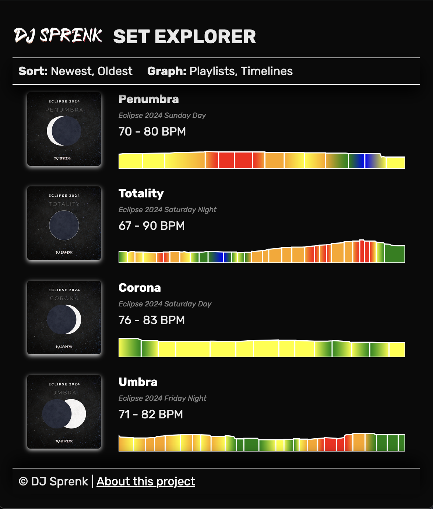

### Settings Menu

Next, I wanted a way to show / hide the settings menu. This was done with basic JS / CSS,
on click of the settings menu icon toggling the show / hide styling on settings bar.

The gotchas here were:

1. I had to make the settings bar invisible instead of setting display to none. This
   makes it easier to preserve the grid layout of the page.
2. To keep the drop shadow behavior of a hidden bar I ended up copying the styling to the
   header as well, but ordering it behind the settings bar so there's actually a drop
   shadow on both elements, you just can't tell with the black-on-black styling.

## More precise. timelines

I took some shortcuts with the original timelines and set the color stops for gradients
at the beginning of each song. This is not incorrect but it is not, strictly speaking,
precise. What I ended up doing was calculating the color stop positions by finding the
midpoint between any two cue points and setting that.

This means the song center is the correct color (from the gradient color stop) and bleeds
towards the color of adjacent songs on the boundaries which is closer to the actual
behavior in most sets.

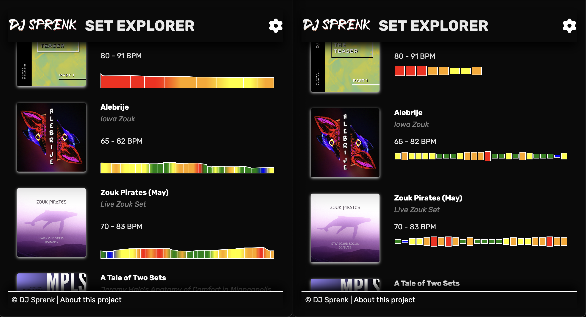

## Adding additional data

I wanted to start adding some more data, an obvious one was run length of each set.

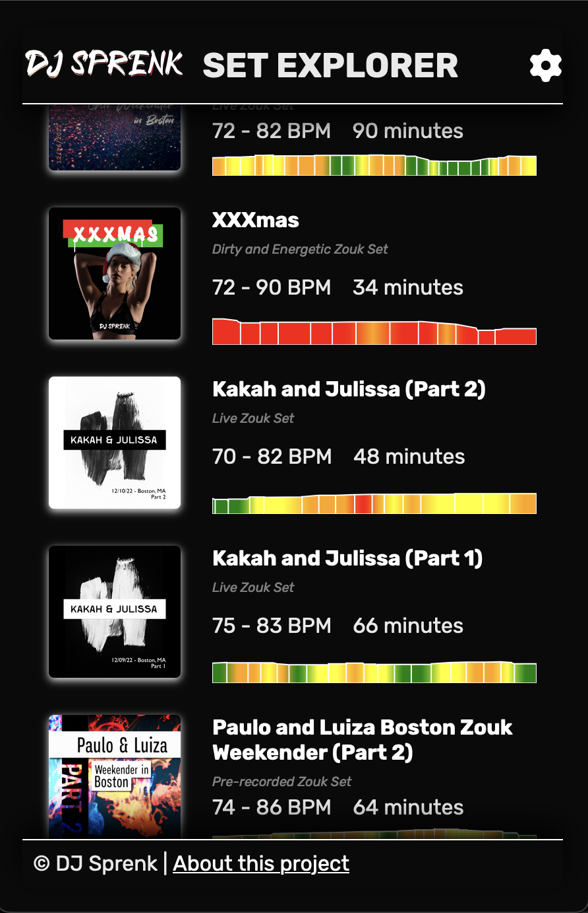

## QOL Improvement - Automatically fetch Database from backup

Previously, whenever I wanted new data from VDJ, I had to follow the steps below:

1. Create a database backup from VDJ.
2. Unzip that backup.
3. Manually copy / paste the contents into the data directory.
4. Run the `database.py` script to convert it into a JSON format.

I wanted to be able to trim out some of these steps, so I created a script that combines
steps 2-4 within the same `database.py` script.

Now I only have to do:

1. Create a database backup from VDJ.
2. Run `database.py` to fetch that data and copy it into the project.
